# ✈️ IMSD 25-26 — Flight Risk Intelligence

<p align="center">
  
</p>

**Prédiction des retards de vols & Intelligence CRM**


---

## 🎯 Présentation du projet

Ce projet de **data science appliqué au CRM aérien** a été réalisé dans le cadre du Master IMSD 25-26 à l'Université d'Évry Paris-Saclay. Il repose sur une base SQLite réelle de **3 millions de vols** (2016–2018) et couvre l'ensemble de la chaîne data : de l'EDA au déploiement Streamlit.

> **Question centrale :** *Peut-on prédire un retard de vol avant le départ, et transformer cette prédiction en action CRM automatisée et personnalisée ?*

---
## 🌐 Application déployée

👉 **[https://flight-crm-boskycrm.streamlit.app/](https://flight-crm-boskycrm.streamlit.app/)**

> L'application est accessible publiquement. Si elle est en veille, cliquez sur **"Wake up"** — elle démarre en quelques secondes.

---

## 📊 Périmètre des données

| Indicateur | Valeur |
|---|---|
| ✈️ Vols analysés | **3 000 000** |
| 📅 Période | **2016 — 2018** |
| 🏢 Source | Base SQLite `batch_1.db` (3 tables) |
| 🎯 Taux de retard (> 15 min) | **18,0 %** |
| 🏆 Meilleur modèle | **LightGBM — AUC 0,695** |
| 📈 Lift à 20 % de ciblage | **~2x — 42 % des retards capturés** |

---

## Architecture du projet

```
imsd_app/
├── app.py                      # Point d'entrée Streamlit · navigation · routing
├── config.py                   # Constantes · seuils CRM · règles CE 261/2004
├── requirements.txt
├── data/
│   ├── batch_1.db              # Base SQLite (vols · aeroports · compagnies)
│   ├── eda_sample.csv          # Échantillon pré-calculé EDA (5 000 lignes)
│   └── scoring_crm_output.csv  # Scoring CRM exporté par le pipeline ML
├── models/
│   └── best_model.pkl          # Pipeline LightGBM sérialisé
├── notebooks/
│   └── crm.py                  # Pipeline ML complet (EDA → modélisation → scoring)
├── utils/
│   ├── data_utils.py           # Chargement SQLite · feature engineering · KPIs
│   ├── model_utils.py          # Prédiction · build_input_row
│   └── crm_utils.py            # Logique CRM · compensation · chatbot
├── pages/
│   ├── page_dashboard.py       # Tableau de bord global (KPIs · carte · heatmaps)
│   ├── page_eda.py             # EDA interactive (4 onglets)
│   ├── page_prediction.py      # Prédiction individuelle (jauge · carte CRM)
│   ├── page_prioritisation.py  # Priorisation CRM (lift · classement)
│   └── page_chatbot.py         # Assistant IA contextuel (CE 261/2004)
└── assets/
└── style.css               # Charte graphique dark mode
```
---

## 🔬 Pipeline ML

<p align="center">
  
</p>

**Validation** : Split temporel (train 2016–2017 / test 2018) + StratifiedKFold 3 folds  
**Contrainte stricte** : zéro fuite de données — toutes les features sont connues avant le départ

---

## 🧠 Logique CRM

| Niveau | Probabilité | Action | Miles |
|---|---|---|---|
| 🟢 Faible | < 25 % | Communication standard | 0 |
| 🟡 Modéré | 25–50 % | Email préventif | 500 |
| 🟠 Élevé | 50–75 % | Push notification + email | 1 500 |
| 🔴 Critique | > 75 % | SMS + agent + compensation | 3 000 |

Compensation **CE 261/2004** déclenchée automatiquement (250 € / 400 € / 600 € selon la distance).

---

## 🚀 Lancer l'application

```bash
# Cloner le repository
git clone https://github.com/Kone320/flight-crm.git
cd imsd-flight-risk-intelligence

# Installer les dépendances
pip install -r requirements.txt

# Pré-calculer l'échantillon EDA (une seule fois)
python preprocess_eda_sample.py

# Générer le modèle et le scoring CRM
python notebooks/crm.py

# Lancer l'application
streamlit run app.py
```

> **Mode démo** : si `best_model.pkl` est absent, l'application fonctionne avec des probabilités simulées cohérentes.

---

## 🛠️ Stack technique

| Technologie | Usage |
|---|---|
| `streamlit` | Interface web · 5 pages · dark mode |
| `lightgbm` | Modèle de prédiction principal |
| `scikit-learn` | Pipeline ML · preprocessing · métriques |
| `plotly` | Visualisations interactives (ROC · lift · carte) |
| `pandas` / `numpy` | Traitement des données · feature engineering |
| `sqlite3` | Lecture de la base `batch_1.db` |

---


## 🏫 Contexte académique

Projet réalisé dans le cadre du cours de **CRM**  
**Université d'Évry Paris-Saclay** · Master IMSD ·2025–2026

---

*Prédire · Segmenter · Agir · Mesurer*
